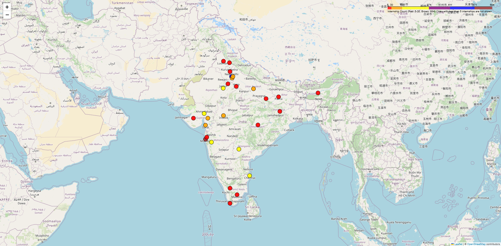
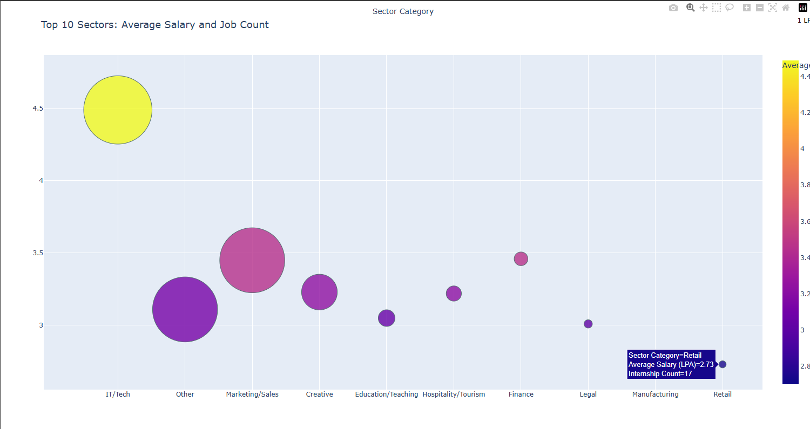
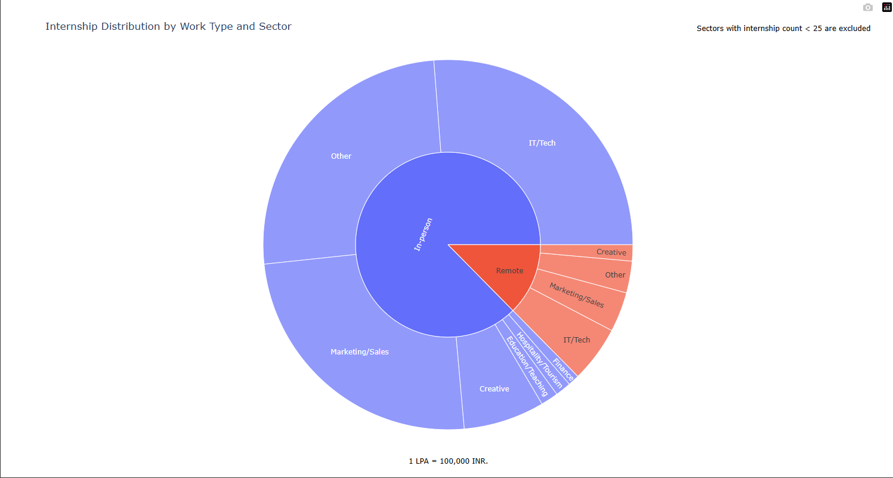
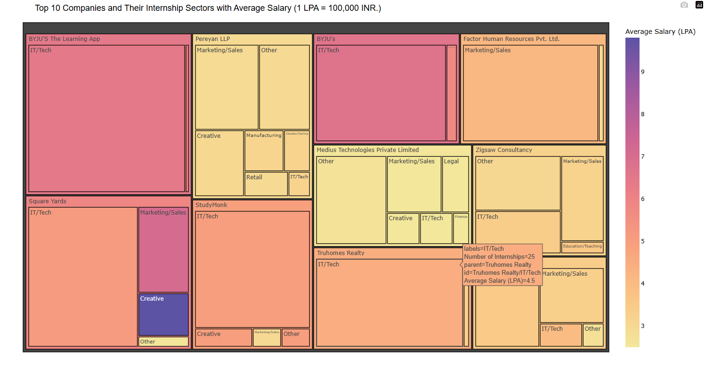
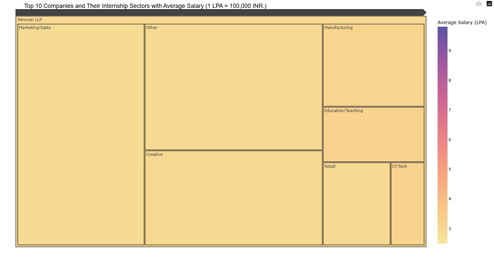
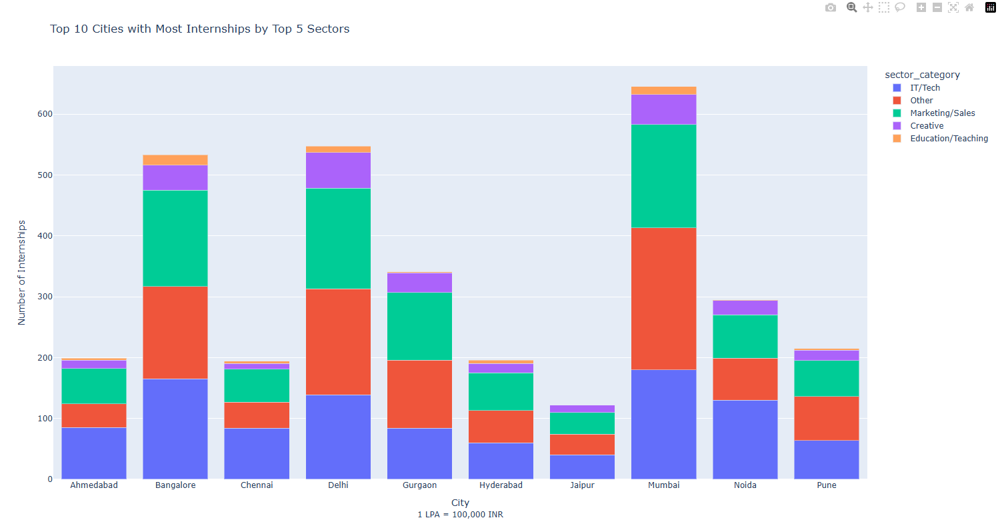

# Internship Opportunities in India: Data Visualization Project

## Project Overview
This project focuses on analyzing and visualizing internship opportunities in India using datasets from Internshala and an Indian Cities Database. The aim is to provide insights into internship trends, including geographical distribution, salaries, and sectors, using interactive visualizations.

## Datasets
### 1. **Internshala Jobs Dataset**
- Contains detailed information about internships in India, including:
  - Over 5,000 rows of data.
  - Columns such as job type, location, salary, and additional attributes.

### 2. **Indian Cities Database**
- Supplementary dataset with information about Indian cities, including:
  - City names.
  - Latitude and longitude coordinates.
  - Population and other geographical attributes.

### Why Use Two Datasets?
The Indian Cities Database was integrated to enhance geographical analysis. By combining city location data with internship distribution, we created more accurate and insightful maps.

## Objectives
1. **Analyze Internship Distribution**: Identify cities with the most opportunities and visualize their geographical spread.
2. **Sector Insights**: Examine popular sectors and their salary trends.
3. **Work Type Analysis**: Compare remote and in-person internships.
4. **Top Companies**: Highlight companies offering the most opportunities.
5. **Advanced Geographical Insights**: Utilize city coordinates to create interactive maps.

## Project Workflow

### Step 1: Data Integration
- Combined the Internshala dataset with the Indian Cities Database using city names as a key.
- Resolved mismatches by standardizing city names in both datasets.
- Enhanced the dataset with latitude and longitude for mapping.

### Step 2: Data Preprocessing
- **Salary Processing**:
  - Calculated averages for salary ranges.
  - Handled missing or incomplete salary data.
- **Location Cleaning**:
  - Replaced missing locations with "Unknown."
  - Standardized city names for consistent analysis.
- **Column Refinement**:
  - Dropped irrelevant columns such as `actively_hiring`.

### Step 3: Analysis Questions
1. **Internship Distribution by City**:
   - Mapped cities with the most opportunities using Folium.
   - Incorporated city coordinates for precise location mapping.
   -  

2. **Sector Analysis**:
   - Categorized internships into sectors (e.g., IT/Tech, Healthcare, Marketing).
   - Calculated internship counts and average salaries by sector.
   - Visualized results using Bubble Charts.
   -  

3. **Remote vs In-Person Internships**:
   - Classified internships into remote and in-person categories.
   - Analyzed distribution and salary trends using Sunburst Charts.
   -  

4. **Top Companies**:
   - Identified companies with the highest internship counts.
   - Grouped internships by company and sector.
   - Presented findings using a Treemap.
   -  
   -  

5. **Top Cities and Sector Distribution**:
   - Analyzed the top 10 cities with the highest internship opportunities.
   - Mapped sector-wise distribution using Stacked Bar Charts.
   -  

### Step 4: Visualization Tools
- **Folium**: For interactive geographical maps.
- **Plotly**: For Bubble Charts, Sunburst Charts, and Treemaps.
- **Matplotlib & Seaborn**: For additional static visualizations.

## Results
### Key Insights:
- **Top Cities**: Bangalore, Mumbai, and Delhi lead in internship opportunities.
- **Popular Sectors**: IT/Tech and Marketing dominate the internship space.
- **Remote Trends**: Remote internships are competitive in terms of salary, especially in IT-related sectors.
- **Geographical Insights**: Using the Indian Cities Database, we visualized precise internship distributions.

## How to Run the Project
1. **Clone the Repository**:
   ```bash
   git clone <repository_url>
